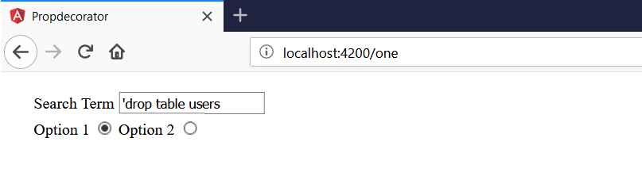
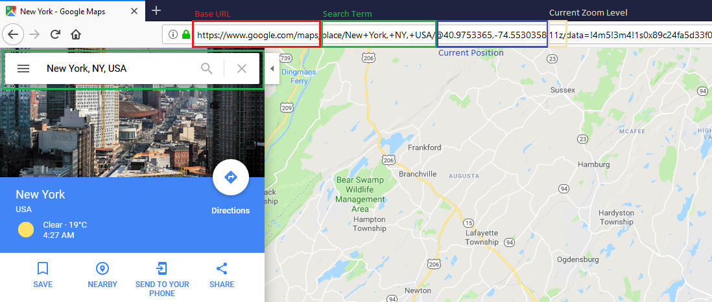

In some Angular applications the current route (or component if you will) holds an internal state of the application.
For example a entered search term and/or selected item in a list.



With a Angular component looking something like this:

```typescript
import { Component } from '@angular/core';

@Component({
  selector: 'app-example-one',
  templateUrl: './example-one.component.html',
  styleUrls: ['./example-one.component.css']
})
export class ExampleOneComponent {
  searchTerm = '';
  searchOption = 1;
}
```

In order to not lose the state when the user refreshes the page (or wants to bookmark/share it) the current state must be persisted somewhere.
While we could persist it in local storage (or session storage or cookie) this approach breaks when the user wants to share the link with another person.
Instead what some applications are doing is to store the state in the URL.
The URL route/query parameters are updated as you change the state of a page.
On good example for this is Google Maps where the current view is encoded into the URL automatically after you change the current view.

[

In Angular what I'm doing most of the time is to use the *<a href="https://angular.io/api/router/ActivatedRoute" target="_blank">ActivatedRoute</a>* service and update query parameters in the URL more less manually after the internal state changes.
Additionally during component initialization I have to read the current query parameters in order to set my internal properties (states) at startup.

```typescript
import { Component, OnInit } from '@angular/core';
import { ActivatedRoute, Router } from '@angular/router';

@Component({
  selector: 'app-example-one',
  templateUrl: './example-one.component.html',
  styleUrls: ['./example-one.component.css']
})
export class ExampleOneComponent implements OnInit {
  searchTerm = '';
  searchOption = 1;

  constructor(private activatedRoute: ActivatedRoute, private router: Router) {
  }

  ngOnInit() {
    if (this.activatedRoute.snapshot.queryParams['searchTerm']) {
      this.searchTerm = this.activatedRoute.snapshot.queryParams['searchTerm'];
    }

    if (this.activatedRoute.snapshot.queryParams['searchOption']) {
      this.searchOption = parseInt(this.activatedRoute.snapshot.queryParams['searchOption'], 10);
    }
  }

  syncQueryParams() {
    this.router.navigate(['.'], {
      relativeTo: this.activatedRoute,
      queryParams: {
        searchTerm: this.searchTerm,
        searchOption: this.searchOption
      }
    });
  }
}
```

Component template:

```text
<div class="form-group">
  <label class="input-label">Search Term</label>
  <input type="text" [(ngModel)]="searchTerm" (ngModelChange)="syncQueryParams()">
</div>

<div class="form-group">
  <label>
    Option 1
    <input type="radio" name="searchOption" [value]="1" [(ngModel)]="searchOption" (ngModelChange)="syncQueryParams()">
  </label>
  <label>
    Option 2
    <input type="radio" name="searchOption" [value]="2" [(ngModel)]="searchOption" (ngModelChange)="syncQueryParams()">
  </label>
</div>
```

This got me thinking if it possible and easier to use Typescript property decorators to mark those properties (that represent my internal state) and automatically synchronize the values with the URL.

Documentation about Typescript Decorator can be found here: <a href="http://www.typescriptlang.org/docs/handbook/decorators.html" target="_blank">TypeScript Decorator</a>

I was hoping I could end up with something like the following code:

```typescript
export class ExampleTwoComponent {
  @UrlState() searchTerm = '';
  @UrlState() searchOption = 1;
}
```

So, whenever this component is initialized those two properties would be set when the URL contains ```?searchTerm=someSearch&searchOption=2``` and when I update the properties in the view it would reflect in the URL automatically.

But at this point I ran into the problem that it is not possible to directly inject (Angular) services into my decorator because they are, after all, just exported functions.
While it is completely possible to implement query parameter updates without *Router* and *ActivatedRoute* I opted for a different solution/hack I found on Stackoverflow[1] in order to inject services into a decorator.

Basically what it does is to inject the service ```Injector``` into your component and then your decorator function taps into the ```ngOnInit``` method of the component to inject its required services.
The complete implementations looks something like this:

```typescript
export class ExampleTwoComponent implements OnInit {
  @UrlState() searchTerm = '';
  @UrlState({
    parseFct: val => parseInt(val, 10)
  }) searchOption = 1;

  constructor(public injector: Injector) {
  }
}
```

```typescript
export function UrlState(settings = {
  parseFct: val => val
}): PropertyDecorator {
  return function (target, propertyKey) {
    let propertyValue;
    let activatedRoute: ActivatedRoute;
    let router: Router;

    const ngOnInitUnpatched = target['ngOnInit'];
    target['ngOnInit'] = function (this) {
      activatedRoute = this.injector.get(ActivatedRoute);
      router = this.injector.get(Router);

      activatedRoute.queryParams
        .subscribe((params) => {
          if (params[propertyKey]) {
            target[propertyKey] = settings.parseFct(params[propertyKey]);
          }
        });

      if (ngOnInitUnpatched) {
        return ngOnInitUnpatched.call(this);
      }
    };

    function getter() {
      return propertyValue;
    }

    function setter(value: any) {
      propertyValue = value;
      if (activatedRoute) {
        const newQueryParam = {};
        newQueryParam[propertyKey] = value;

        router.navigate(['.'], {
          relativeTo: activatedRoute,
          queryParams: newQueryParam,
          queryParamsHandling: 'merge',
          replaceUrl: true
        });
      }
    }

    Object.defineProperty(target, propertyKey, {
      get: getter,
      set: setter,
      enumerable: true,
      configurable: true
    });
  };
}
```

Additionally, the decorator takes a (parser) function as parameter because when retrieving the value from the route it is returned as a string.
The serialization/deserialization from and to query parameters could probably be done automatically in the decorator for primitive data types but this is just a quick and dirty proof of concept.
It would be even possible to encode properties of type object into query parameters with those converter functions.

---

[1] <a href="https://stackoverflow.com/questions/48873883/angular-aot-custom-decorator-error-encountered-resolving-symbol-values-staticall/48875749#48875749" target="_blank">https://stackoverflow.com/questions/48873883/angular-aot-custom-decorator-error-encountered-resolving-symbol-values-staticall/48875749#48875749</a>

<a href="https://toddmotto.com/angular-decorators#creating-a-decorator" target="_blank">https://toddmotto.com/angular-decorators#creating-a-decorator</a>

