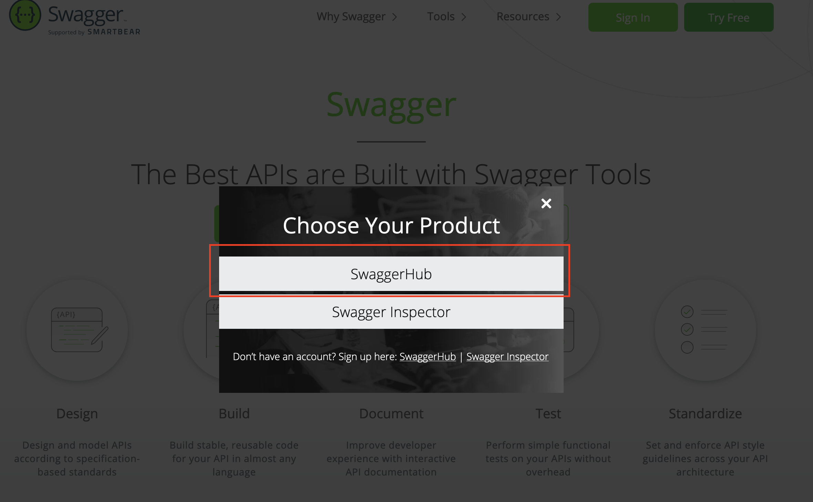
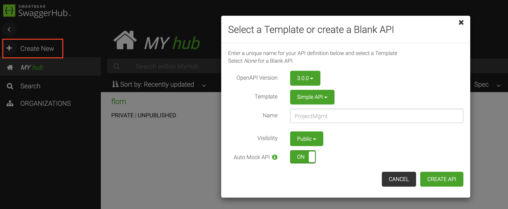
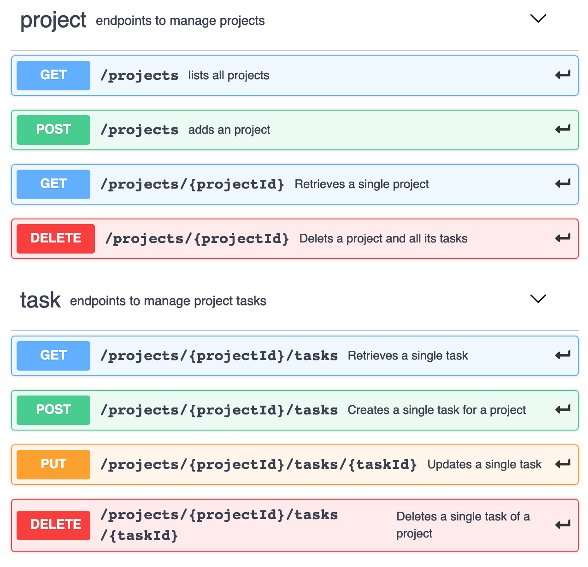
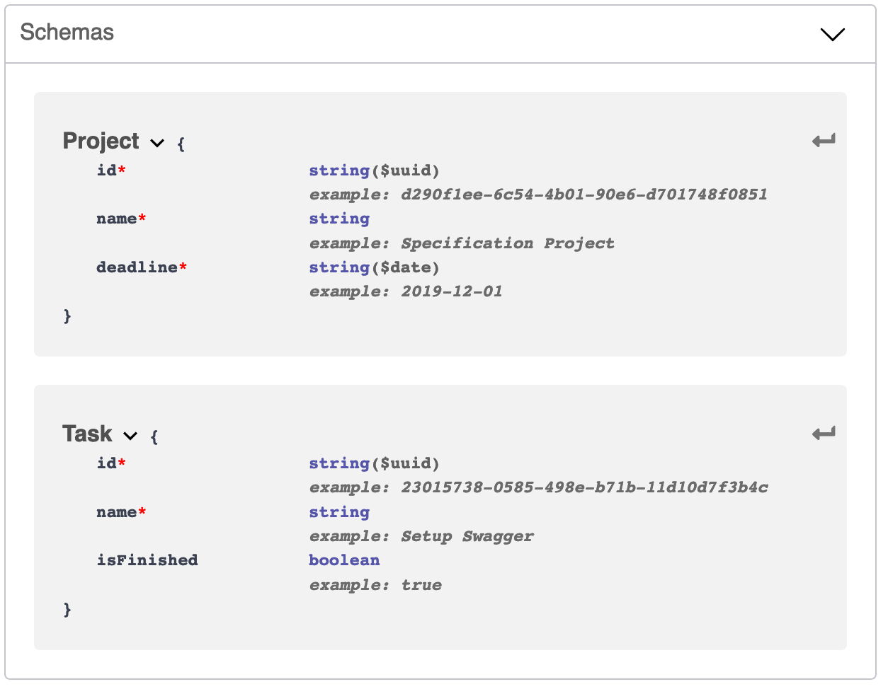
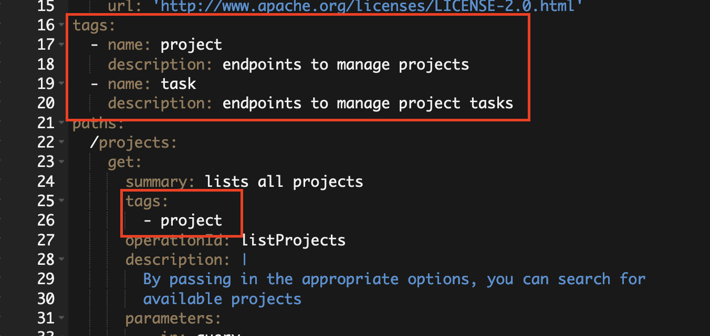
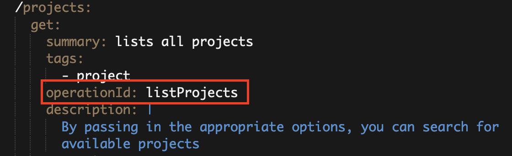
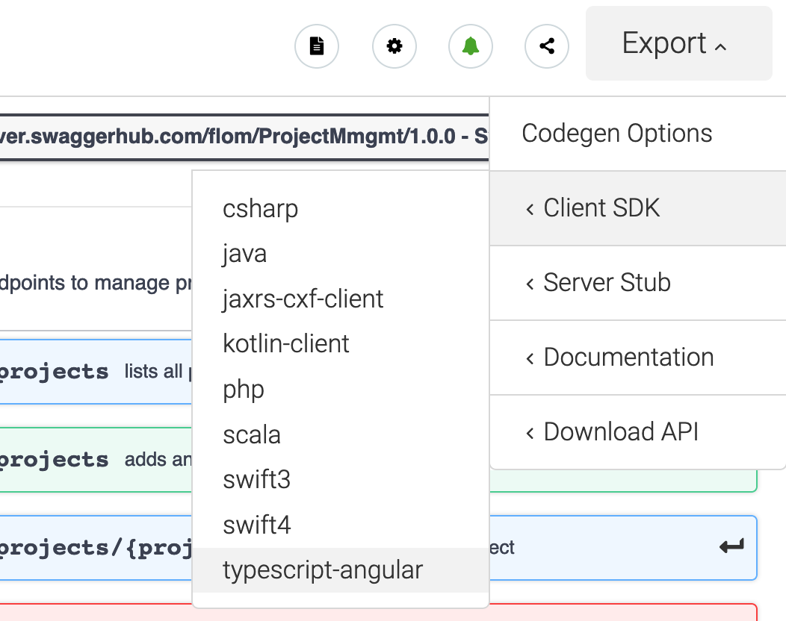
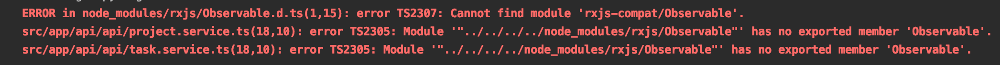
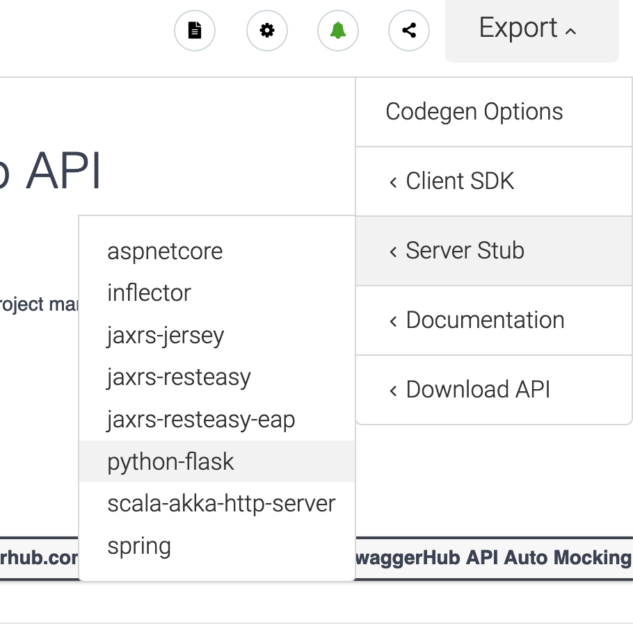

## Designing REST-APIs

Over the years there has been many approaches to expose your service/business-layer to the outside world in a (programming) language agnostic way via APIs.
The APIs could be as low-level as direct TCP/IP socket connections or more standardized (and complex) as the SOAP standard.
But with on-going rise of the web the most common API approach you will find is that of a REST-API.
Most single page application are accessing the backend services via REST-APIs but they are also used for 'standalone' services like weather data,
github, or even for a database (CouchDB).

But one disadvantage of building a REST-API is that the consumer must know all the endpoints, which methods are allowed on them,
and what data structure the API expects. 
To get this information you have more or less three possibilities:

1. You wrote the API yourself
2. You ask the person who wrote it
3. You resort to the documentation 

But when multiple people are relying on the REST-API the first two options are no longer working so having a documentation is the only solution.
But relying on documentation brings its own problems along, for example being out of date, simply wrong or incomplete.
Additionally on how the documentation is presented might vary from API to API. 

## OpenAPI Initiative (OAI)

The OpenAPI Initiative defines a specification on how REST-APIs are described and documented as described on their about page:

<a href="https://www.openapis.org/about" target="_blank">https://www.openapis.org/about</a>

> The OpenAPI Initiative (OAI) was created by a consortium of forward-looking industry experts who recognize the immense value of standardizing on how REST APIs are described. As an open governance structure under the Linux Foundation, the OAI is focused on creating, evolving and promoting a vendor neutral description format. SmartBear Software is donating the Swagger Specification directly to the OAI as the basis of this Open Specification. 

Before the OAI there was (and still is) the tool ecosystem Swagger (<a href="https://swagger.io/" target="_blank">https://swagger.io</a>).
Swagger had its own specification language to specify and document REST-APIs and additionally tooling to generate documentation pages and even code stubs.
Swagger was taken into the OAI and it's Swagger specification 2.0 was renamed to the OpenAPI Specification. 
By now the OpenAPI Specification is at version 3.

The cool thing about having a standard language on how to describe the API is that it is possible to provide standardized/generated documentation and generate code for the client and server.
Because I have never tried the complete workflow (write specification -> generate code -> implement business logic) with 
the OpenAPI Specification I wanted to do a small example project with this approach.

## Example 'Project Management App'

For the small example project I'm doing a shitty little project management application with following features:

- Create projects with name and deadline
- Add tasks to a project
- Delete tasks from a project
- Set tasks to finished

## Writing the API specification on SwaggerHub

The first step is to visit <a href="https://swagger.io/" target="_blank">https://swagger.io</a> and sign in into *SwaggerHub*.



After the login you will see your personal Hub where you can create a new API:



With the option **Auto Mock API** Swagger will generate static mock data based on your defined endpoints and data structures.
Using **Simple API** as a template gives a quick starting point for the API without having to know the OpenAPI specification.

To get a good overview of the specification language you can visit <a href="https://app.swaggerhub.com/help/tutorials/openapi-3-tutorial" target="_blank">OpenAPI 3.0 Tutorial</a>.
For quickly looking up the syntax of single elements the <a href="https://swagger.io/docs/specification/basic-structure/" target="_blank">Specification</a> is a good starting point.

After adding the endpoints for my Project Management App my endpoints look like this:



And the data structures are as following:



The same example data you enter into your specification will be used for the **Auto Mock API**.
If enabled, the Mock API is available under `https://virtserver.swaggerhub.com/[username]/[ProjectName]/[version]/`.
For the client side code generation this url is taken as well as a fallback URL if you don't provide one yourself.

Before generating the code for client and server you should give a quick glance at the tags you defined in your specification.



For the generated documentation page all they seem to do is put your endpoints into sections (in my case *project* and *task*).
But later for code generation the generator will put the sections/tags into different files/classes.
For Angular this ends up being two services (project.service.ts and task.service.ts) and for the Python Flask server code two files are generated (project_controller.py and task_controller.py).

Another important setting is the *operationId*:



The *operationId* is used to generate the specific method names for your client/server code.

## Downloading client code for Angular

After the specification is done you can now generate the code for your front- and backend.
For angular the process looks like this:

### Download code via *Export -> ClientSDK -> typescript-angular*



In my case the files look like this:

```text
api
+-- api.ts
+-- project.service.ts
+-- task.service.ts
model
+-- models.ts
+-- project.ts
+-- task.ts
api.module.ts
configuration.ts
...
```

Under `api` you will find the injectable services.
The folder `model` contains the defined data structures.
`api.module.ts` defines the module which can be imported into your application and `configuration.ts` contains the settings like *API base URL*.

### Add the client to you project

After you copied the generated files into your project you have to import it into your app module.
Also you have to add the `HttpClientModule` in order to use the services.

app.module.ts
```typescript
@NgModule({
  ...
  imports: [
    ...
    HttpClientModule, // required by ApiModule
    ApiModule // generated code from SwaggerHub
  ],
  ...
  bootstrap: [AppComponent]
})
export class AppModule {
}
```

Normally it shouldn't be necessary to edit the generated client code.
But after running the project you might see following error when running the project:



The solution for this error I found on Stackoverflow (<a href="https://stackoverflow.com/questions/49840152/angular-has-no-exported-member-observable" target="_blank">https://stackoverflow.com/questions/49840152/angular-has-no-exported-member-observable</a>)
Turns out beginning with *rxjs 6+* the import lines for `Observable` changed a little bit.
So one solution is to go into your `*.service.ts` files and change the lines

```typescript
import { Observable } from 'rxjs/Observable'; // wrong
import { Observable } from 'rxjs'; // works
```

or install the package *rxjs-compat*

```
npm install rxjs-compat --save
```

The last thing you might want to change is the *API base URL*.
Running the application as it is the service will send the requests against the Swagger Mock Server.
To quickly overwrite the URL you can add a new entry into your `environment.ts` file and provide `BASE_PATH` with this value:

environment.ts
```typescript
export const environment = {
  production: false,
  base_path: 'http://localhost:8888'
};
```

app.module.ts
```typescript
import { environment } from '../environments/environment';

@NgModule({
  ...
  providers: [{
    provide: BASE_PATH,
    useValue: environment.base_path
  }],
  bootstrap: [AppComponent]
})
export class AppModule {
}
```

### Using the services

The usage of the generated services is more or less the same as if you would have written them yourself.
Simply inject them into your component and call the methods as defined in your specification via the *operationId*:

```typescript
import { Component, OnInit } from '@angular/core';
import { Project, ProjectService } from '../api';

@Component({
  selector: 'app-project-overview',
  templateUrl: './project-overview.component.html'
})
export class ProjectOverviewComponent implements OnInit {

  projects: Project[] = [];

  constructor(private projectService: ProjectService) {
  }

  ngOnInit(): void {
    this.projectService.listProjects()
      .subscribe((projects: Project[]) => {
        this.projects = projects;
      }, (error) => {
        console.log('error', error);
      });
  }
}
```

## Downloading server code for Python Flask 

For the server code I won't go much into detail.
To download it simply go to SwaggerHub and click on *Export -> Server Stub -> python-flask*:



As opposed to the client code the generated server code is not ready to use out of the box.
What it does is generate a ready-to-run application with the endpoints but with placeholders for the implementation:

project_controller.py
```python
import connexion
import six

from swagger_server.models.project import Project  # noqa: E501
from swagger_server import util

import connexion
import six

from swagger_server.models.project import Project  # noqa: E501
from swagger_server import util


def add_project(body=None):  # noqa: E501
    """adds an project

    Adds a project # noqa: E501

    :param body: The added project
    :type body: dict | bytes

    :rtype: None
    """
    if connexion.request.is_json:
        body = Project.from_dict(connexion.request.get_json())  # noqa: E501
    return 'do some magic!'

# ...remaining endpoints...
```


